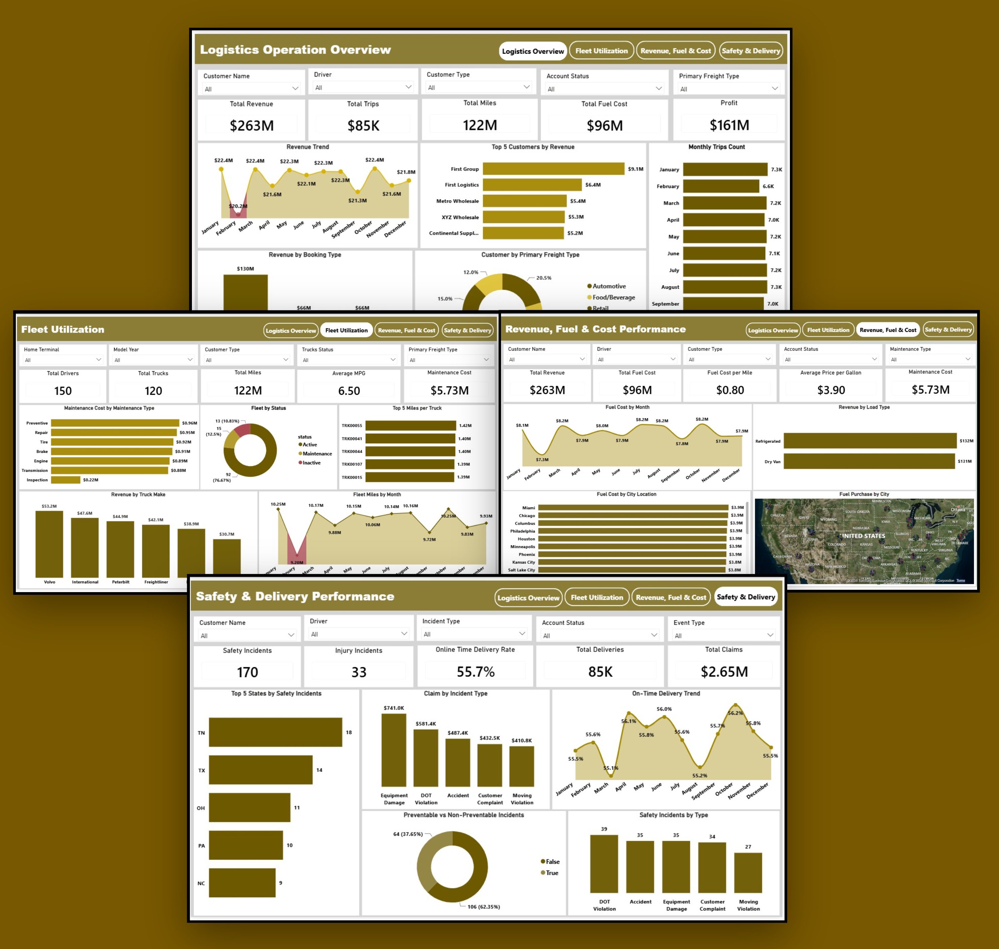
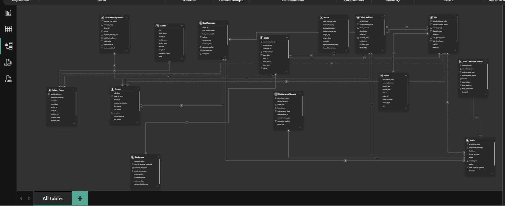
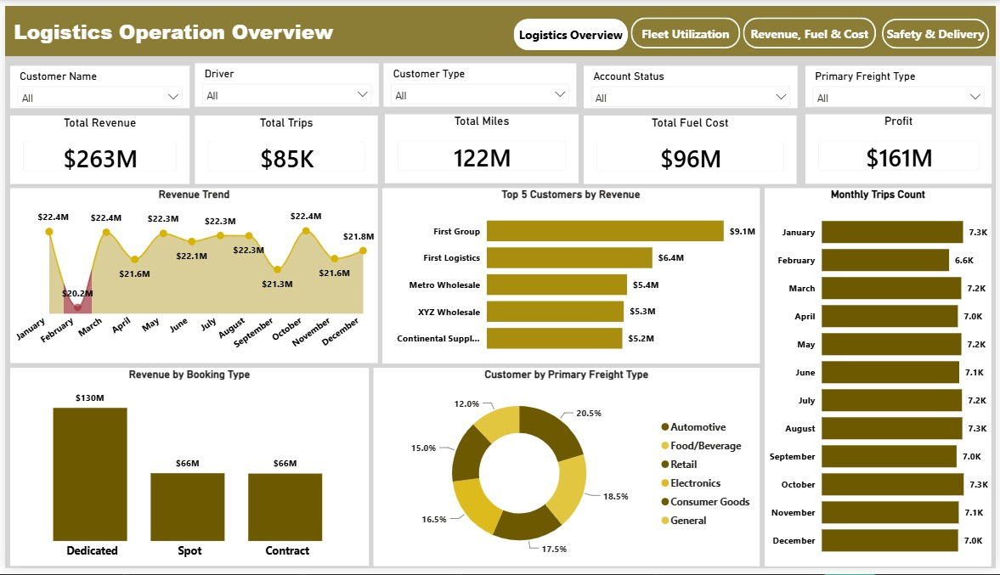
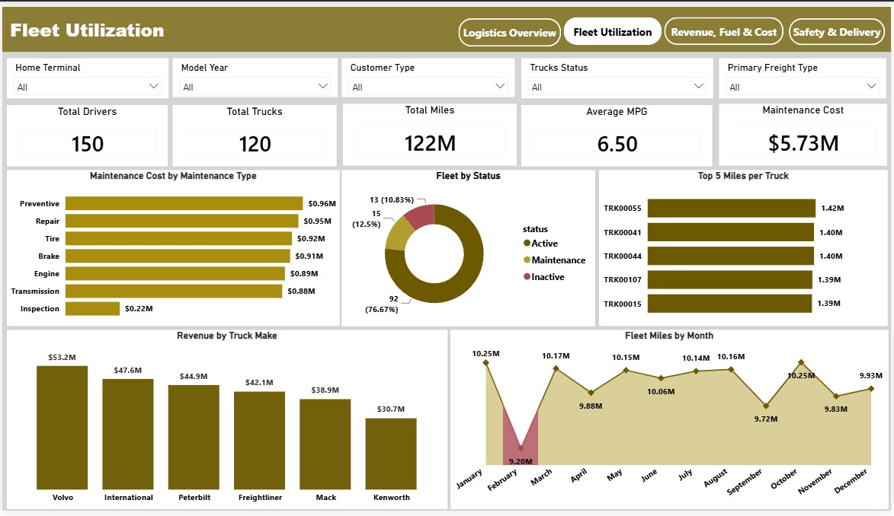
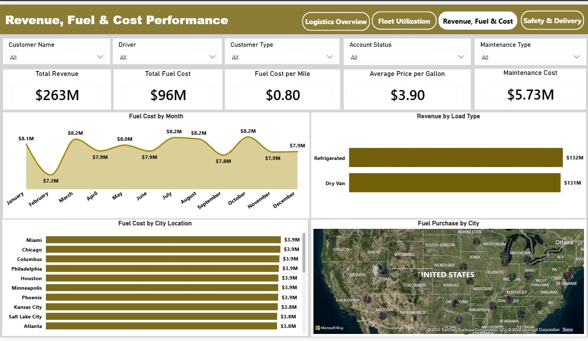
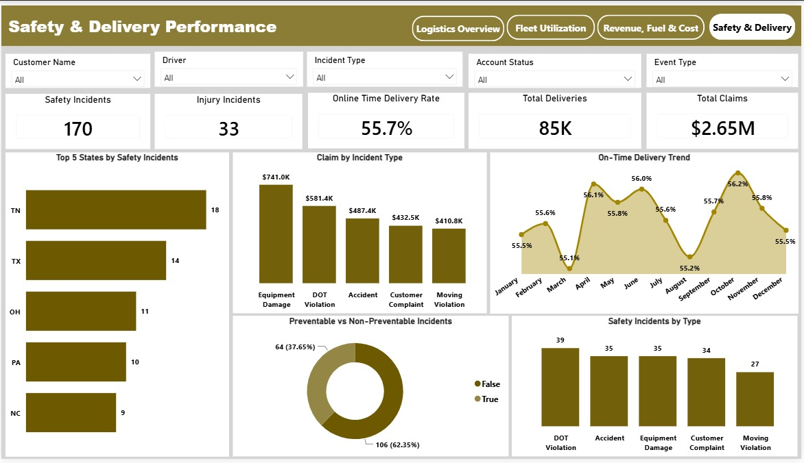

# 🚚 Logistics Operations Performance Dashboard

## End-to-End Analysis of Fleet, Revenue, Cost, Safety & Delivery Performance

# **Project Overview**

The Logistics Operations Performance Dashboard is an interactive Power BI project built to analyze logistics operations across fleet utilization, revenue, operating costs, fuel performance, safety incidents, and delivery performance.

The project uses a multi-table Logistics Operations Schema containing operational data across customers, drivers, trucks, trips, loads, routes, fuel purchases, maintenance, safety incidents, and delivery events.

The analysis transforms operational data into interactive dashboards that provide a detailed view of logistics performance and highlight areas that can support better operational and cost-management decisions.

# Business Problem

Logistics operations generate data across multiple areas of the business, including fleet activity, trips, fuel consumption, maintenance, revenue, safety, and deliveries.

When these areas are analyzed separately, it can be difficult to understand overall operational performance or identify areas requiring attention.

This project brings these datasets together in Power BI to provide a centralized view of logistics performance and answer key questions around:

* Fleet utilization
* Revenue performance
* Fuel and maintenance costs
* Safety incidents
* Delivery performance
* Customer and booking performance

# Key Business Questions

The analysis was designed to answer questions such as:

* How is overall logistics revenue performing?
* Which customers and booking types generate the most revenue?
* How efficiently is the fleet being utilized?
* Which truck makes and trucks contribute the most miles or revenue?
* How much is being spent on fuel and maintenance?
* Which load types and cities contribute most to revenue and fuel costs?
* What types of safety incidents occur most frequently?
* Which locations record the highest number of safety incidents?
* How many incidents are preventable?
* How is on-time delivery performing over time?
* Where are there opportunities to improve operational efficiency and cost management?

# 📊 Dataset Overview

The project is based on a Logistics Operations Schema containing multiple related tables covering different areas of logistics operations, including:

* Customers
* Delivery Events
* Driver Monthly Metrics	
* Drivers
* Facilities
* Fuel Purchases
* Loads
* Maintenance Records
* Routes
* Safety Incidents
* Trailers
* Trips
* Truck Utilization
* Trucks

# **Data Preparation & Transformation**

Data preparation was performed using Power Query before building the dashboard.

## Data Cleaning

* Removed inconsistencies and duplicates
* Changed columns to appropriate data types
* Renamed columns for consistency and readability
* Standardized text values and categories

## Data Transformation

Additional calculated columns were created where required to support the analysis and dashboard visualizations.

The transformed data was then loaded into Power BI for modeling and analysis.

## Data Modeling

Model Components

The data model brings together the following operational areas:

* Customer
* Delivery Events
* Driver Monthly Metrics
* Drivers
* Facilities
* Fuel Purchases
* Loads
* Maintenance Records
* Routes
* Safety Incidents
* Trailers
* Trips
* Truck Utilization
* Trucks

## Key Metrics

* Total Revenue: $263M
* Profit: $161M
* Fuel Cost: $96M
* Maintenance Cost: $5.73M
* Total Miles: 122M
* Fuel Cost Per Mile: $0.80
* Safety Incidents: 170
* Injury Incidents: 33
* On-Time Delivery: 55.7%

Fuel costs represent approximately 36.5% of total revenue, making fuel one of the most significant operating cost areas in the logistics operation.

# **📈 Power BI Dashboard Structure**

The dashboard consists of four interconnected pages, each focused on a different aspect of logistics performance.

## Page 1 — Logistics Overview

Purpose: Provide a detailed view of logistics performance across revenue and customers.

Key Insights

* February recorded the lowest monthly revenue at $20.2M.
* January, March, and October each recorded $22.4M in revenue.
* Dedicated booking type generated the highest revenue among booking types.
* First Group was the highest-revenue customer among the top five customers, generating $9.1M.
* January recorded the highest trip count with approximately 7.3K trips.

## Page 2 — Fleet Utilization

Purpose: Evaluate fleet performance by examining maintenance costs, miles per truck, and fleet miles per month.

Key Insights

* Volvo generated the highest revenue among truck makes, at approximately $52M.
* 92 fleet units, representing 76.67% of the fleet, were active.
* Preventive maintenance recorded the highest maintenance cost at approximately $0.96M, followed by repair and tire-related maintenance.
* February recorded approximately 9.20M downtime fleet miles.
* TRK0055 recorded the highest miles per truck.

## Page 3 — Revenue, Fuel & Cost

Purpose: Identify operating cost, revenue, and fuel performance across the logistics operation.

Key Insights

* February recorded the lowest fuel cost for the month.
* Refrigerated loads generated the highest revenue among load types.
* Miami recorded the highest fuel cost among cities.
* Total fuel cost reached $96M, representing approximately 36.5% of total revenue.
* Fuel cost per mile was approximately $0.80.
* Total maintenance cost reached $5.73M.

## Page 4 — Safety & Delivery

Purpose: Identify incident rates, preventable incidents, and the impact of on-time delivery on logistics efficiency.

Key Insights

* Tennessee (TN) recorded the highest number of safety incidents.
* Equipment Damage was the most common incident type by claims.
* 64 incidents (37.65%) were classified as preventable.
* 106 incidents (62.35%) were classified as non-preventable.
* The on-time delivery trend shows that more than half of deliveries arrived late each month.
* DOT Violations recorded 39 safety incidents.

## Key Findings

1. Fuel represents a significant operating cost

Fuel costs totaled $96M, approximately 36.5% of total revenue. This highlights fuel efficiency and fuel-cost management as important areas for operational improvement.

2. Delivery performance requires attention

The overall on-time delivery rate was 55.7%, while the monthly trend showed that more than half of deliveries arrived late each month. This indicates a consistent delivery-performance challenge rather than an isolated issue.

3. Fleet activity is not fully utilized

Although 92 fleet units (76.67%) were active, the dashboard also identified significant downtime mileage, with 9.20M downtime fleet miles recorded in February.

4. Maintenance costs are concentrated in preventive maintenance

Preventive maintenance represented the largest maintenance cost category at approximately $0.96M, followed by repair and tire-related maintenance.

5. Safety incidents are concentrated in specific areas

Tennessee recorded the highest number of safety incidents, while Equipment Damage was the most common incident type. This provides an opportunity to investigate location-specific and equipment-related safety risks.

6. Revenue performance varies across operational dimensions

Revenue performance differs significantly by booking type, customer, truck make, and load type. Dedicated bookings, First Group, Volvo, and refrigerated loads were among the strongest revenue contributors identified in the analysis.

## Recommendations

Based on the overall analysis, the following actions could help improve logistics performance:

* Improve fuel efficiency: Monitor fuel cost per mile across trucks, routes, and locations, particularly in areas with higher fuel costs.
* Reduce fleet downtime: Investigate the causes of downtime and identify opportunities to improve fleet utilization and maintenance planning.
* Improve delivery performance: Analyze the causes of recurring late deliveries and monitor performance by route, facility, and customer.
* Strengthen safety management: Investigate locations and incident types with higher safety occurrences, particularly equipment damage and DOT violations.
* Optimize maintenance planning: Continue monitoring preventive maintenance, repair, and tire-related costs to reduce avoidable downtime and maintenance expenses.
* Support revenue growth: Identify and build on the factors contributing to strong performance across high-revenue customers, booking types, truck makes, and load types.

## Technologies Used

* Power BI — Dashboard development and data visualization
* Power Query — Data cleaning and transformation
* DAX — Measures and analytical calculations
* Data Modeling — Relationships across multiple logistics tables

## Project File

The complete Power BI project file is available below:

[Download the Power BI project file](./logistics-operations-project.pbix)

## Conclusion

The Logistics Operations Performance Dashboard demonstrates how data from multiple operational areas can be combined and analyzed to provide a comprehensive view of logistics performance.

The analysis highlights key areas including revenue generation, fleet utilization, fuel and maintenance costs, safety incidents, and delivery performance.

By bringing these areas together in an interactive Power BI dashboard, the project provides a data-driven foundation for identifying operational inefficiencies, monitoring performance, and supporting better logistics decision-making.

## **Author**

John Ubi

Data Analyst | Power BI | SQL | Power Query | Storytelling 

## Connect With Me

LinkedIn: https://www.linkedin.com/in/john-ubi-858911292
Email: ubijohn001@gmail.com

